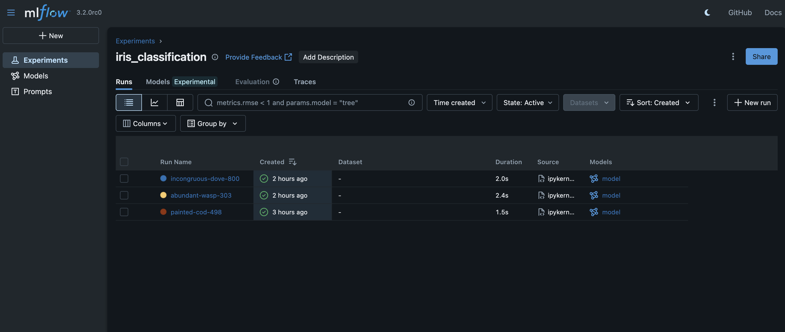
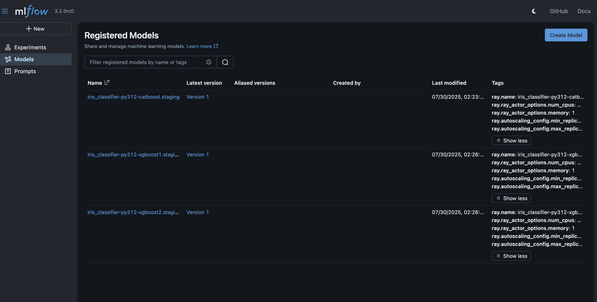
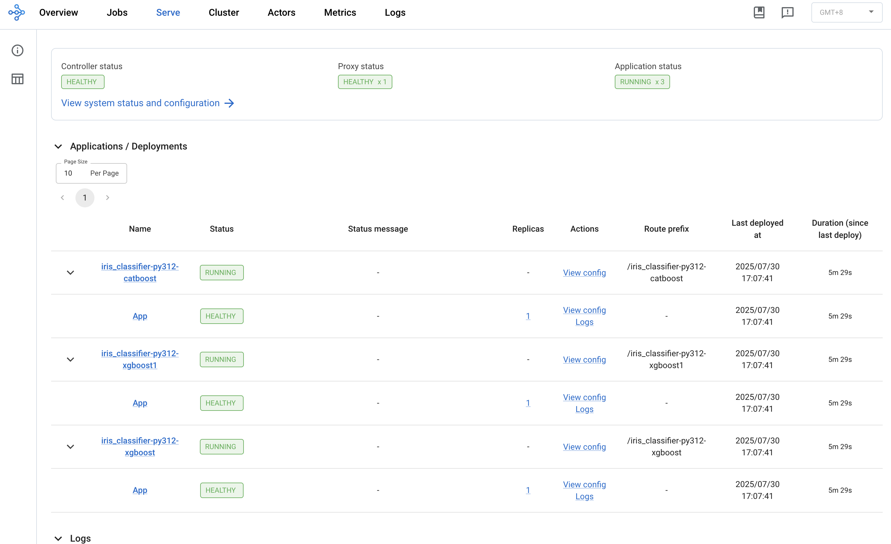
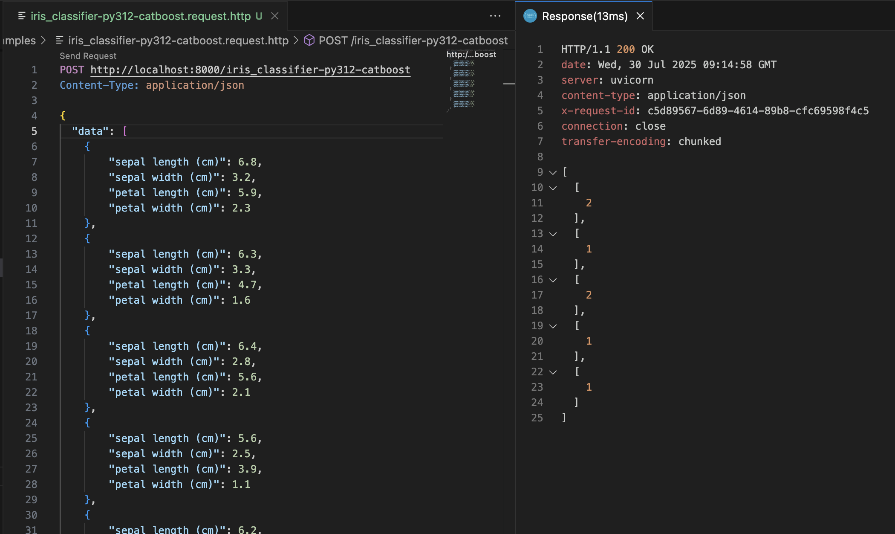

# MLflow x Ray Serve (MLRay) Demo

This is a demo of how [MLflow](https://mlflow.org/) models can be deployed with [Ray Serve](https://docs.ray.io/en/latest/serve/index.html) running on a Ray Cluster deployed on your own VMs.

> Each Ray Cluster assumes the same major Python version and Ray version across all its tasks/deployments (see [Ray's documentation on Environment Dependencies](https://docs.ray.io/en/latest/ray-core/handling-dependencies.html)). The Ray team recommends multiple Ray Clusters for each major Python version to be supported (see [Ray's discussion forum](https://discuss.ray.io/t/how-to-use-different-python-versions-in-the-same-cluster/15825)).

## Setting Up for Development

### Setting up Local Environment

1. Install the following:
    - [pyenv](https://github.com/pyenv/pyenv) for switching between Python versions easily
    - [uv](https://docs.astral.sh/uv/getting-started/installation/) for Python package and project management


2. Install [Podman](https://podman.io/docs/installation) for a container runtime e.g.
    ```sh
    podman machine init --memory 8192 --cpus 4 --rootful
    podman machine start
    podman machine inspect
    ```

3. Install this project's Python version with `pyenv`, install Python dependencies with `uv` and activate the virtual environment:

    ```sh
    pyenv install
    uv sync
    source .venv/bin/activate
    ```

### Running Local Ray Cluster

Run a single-node setup locally without metrics visualization with:

```sh
ray start --head --dashboard-host=0.0.0.0 
```

...and visit Ray Dashboard at http://localhost:8265.

Alternatively, to enable metrics visualization, we follow ([Ray Serve's instructions](https://docs.ray.io/en/latest/cluster/metrics.html)) to run Prometheus and Grafana locally first:

1. Run Prometheus:

    ```sh
    ray metrics launch-prometheus &
    rm -rf prometheus-* # Remove temporary files
    ```

2. Download [Grafana and set it up](https://grafana.com/docs/grafana/latest/setup-grafana/):

    ```sh
    GF_SERVER_HTTP_ADDR=localhost GF_SERVER_HTTP_PORT=3000 ./bin/grafana server --homepath ./grafana --config /tmp/ray/session_latest/metrics/grafana/grafana.ini web
    ```

    or alternatively, using podman:

    ```sh
    podman run -d --name grafana --network host \
        -e GF_SERVER_HTTP_PORT=3000 \ 
        -v /tmp/ray:/tmp/ray:ro \
        -v /tmp/ray/session_latest/metrics/grafana/grafana.ini:/etc/grafana/grafana.ini:ro \
        -v /tmp/ray/session_latest/metrics/grafana/provisioning:/etc/grafana/provisioning:ro \
        docker.io/grafana/grafana
    ```


3. Lastly, start Ray with metrics visualization:

    ```sh
    RAY_GRAFANA_HOST=http://localhost:3000 RAY_GRAFANA_IFRAME_HOST=http://localhost:3000 RAY_PROMETHEUS_HOST=http://localhost:9090 ray start --head --dashboard-host=0.0.0.0 
    ```

...and visit the Grafana at http://localhost:3000

### Running Local MLflow 

This demo assumes that there is a running instance of MLflow server that would serve as the ML model registry. This MLflow server needs to be network-accessible by the Ray Clusters.

For development, you can run a MLflow server using Podman in the same network as the Ray Clusters:

```sh
podman network create mlray-net
podman run -d --name mlflow-server --network mlray-net -p 8080:8080 ghcr.io/mlflow/mlflow \
mlflow server --host 0.0.0.0 --port 8080
```
...and visit MLflow's web UI at http://localhost:8080.

### Deploying Trained Models

We demonstrate training and deploying ML models with conflicting library versions.

1. Set up a virtual environment with `pyenv`

    For example, set it up for `3.12.11`:
    ```sh
    pyenv install 3.12.11
    pyenv shell 3.12.11
    python -m venv .venv.py312/
    ```

    > Note that these versions need to match the Ray Cluster, down to the patch number

2. Copy `.env.template` as `.env` and configure the required environment variables

3. Train different ML models with different library versions, and log them all to MLflow:

    For example, we train and log 2 models by running `train_xgboost_model.ipynb` in the virtual environment after installing their required dependencies:

    1. The 1st model uses Xgboost 1.X on Python 3.12, with its PIP requirements in `examples/requirements.iris_classifier-py312-xgboost1.txt`

        ```sh
        source .venv.py312/bin/activate
        pip install -r examples/requirements.iris_classifier-py312-xgboost1.txt
        # Now run `train_xgboost_model.ipynb` with this Python kernel
        ```

    2. The 2nd model uses Xgboost 2.X on Python 3.12, with its PIP requirements in `examples/requirements.iris_classifier-py312-xgboost2.txt`

        ```sh
        source .venv.py312/bin/activate
        pip install -r examples/requirements.iris_classifier-py312-xgboost2.txt
        # Now run `train_xgboost_model.ipynb` with this Python kernel
        ```

    > MLflow automatically [infers the required dependencies](https://mlflow.org/docs/latest/ml/model/dependencies) of the trained model when the `log_model(model)` method is called. 

    

4. On MLflow, for each model that is to be deployed, [register each model](https://mlflow.org/docs/latest/ml/model-registry) with a `.staging` suffix in their name, and promote a trained model version under the registered model

    For example, register a model each for `iris_classifier-py312-xgboost1.staging` and `iris_classifier-py312-xgboost2.staging` based on the trained models in the previous step

    

    4. For each registered model to be deployed, add the following tags to configure their corresponding [Ray Serve deployments](https://docs.ray.io/en/latest/serve/configure-serve-deployment.html):

    | **Tag** | **Required** | **Example** | **Description** |
    |:--------|:------------:|:------------|:----------------|
    | `ray.name` | Yes | `iris_classifier-py312-xgboost1` | Name of the deployment |
    | `ray.ray_actor_options.num_cpus` | Yes | `0.5` | Number of CPUs per replica |
    | `ray.ray_actor_options.memory` | Yes | `1` | Memory in GB per replica |
    | `ray.ray_actor_options.runtime_env.env_vars` | No | `{"ENV_VAR": "value"}` | Environment variables for deployment |
    | `ray.autoscaling_config.min_replicas` | No | `1` | Min. no. of replicas for the deployment.<br/>Default value: 1 |
    | `ray.autoscaling_config.max_replicas` | No | `100` | Max. no. of replicas for the deployment.<br/>Default value: 100 |
    | `ray.user_config.max_batch_size` | No | `8` | Max batch size for [Ray Serve dynamic request batching](https://docs.ray.io/en/latest/serve/advanced-guides/dyn-req-batch.html).<br/>Request batching is disabled unless this is specified. |
    | `ray.autoscaling_config.target_ongoing_requests` | No | `2` | Average no. of ongoing requests per replica that the [Ray Serve autoscaler](https://docs.ray.io/en/latest/serve/autoscaling-guide.html) tries to ensure.<br/>Default value: 2 if batching is disabled, otherwise max batch size |

5. Copy `config.example.yml` to `config.yml` and update the configuration as necessary

6. Run the `mlray generate-config` command to generate the corresponding [Ray Serve config](https://docs.ray.io/en/latest/serve/production-guide/config.html) file or update a given Kubernetes custom resource YAML with the Ray Serve config e.g.:

    ```sh
    # For deploying directly to a Ray Cluster
    # You can preview the generated Ray Service config at `py312.serve_config.yml`
    mlray generate-config config.yml --serve_config_path=py312.serve_config.yml

    # For deploying on Kubernetes via KubeRay
    # Be sure to tweak the Kubernetes YAML config at examples/rayservice-py312.kuberay.yml first based on your resource requirements
    mlray generate-config config.yml --kuberay_config_path=examples/rayservice-py312.kuberay.yml
    ```

    > For each model, this command reads from `python_env.yml` and `requirements.txt` in the [MLflow model artifact](https://mlflow.org/docs/latest/ml/model/dependencies) to determine its required Python version and PIP dependencies for Ray Serve. It also reads from each model's tags to configure the Ray Serve deployment.

7. Deploy the Ray Serve config e.g.:

    ```sh
    # Deploy directly to a Ray Cluster
    RAY_DASHBOARD_ADDRESS=http://localhost:8265 serve deploy py312.serve_config.yml

    # Deploy on Kubernetes via KubeRay
    kubectl apply -f examples/rayservice-py312.kuberay.yml
    ```

    Check the respective Ray dashboards to check on the status of the deployments.

    


7. Verify that the model serving endpoints are working with e.g. REST requests like those in `examples/xxx.request.http`

    

    For Kubernetes, to access the Ray Dashboard and Ray Serve endpoints from localhost, you would need to `kubectl port-forward` first:
    ```sh
    kubectl port-forward service/rayservice-py312-head-svc 8265 &
    kubectl port-forward service/rayservice-py312-serve-svc 8000 &
    ```

## Running Multi-Node Ray Cluster without Kubernetes

### Overview

You can run a multi-node Ray Cluster without Kubernetes, and use the instructions on "Deploying Trained Models" to deploy models from MLflow onto Ray Serve.

>  However, note that without Kubernetes, this Ray Cluster has limited [fault tolerance features](https://docs.ray.io/en/latest/serve/production-guide/fault-tolerance.html).


For development and testing, you can do this on a single machine. Otherwise, you run the Ray Cluster on actual VMs.

### On a single machine using Podman

For development & testing, you can emulate multiple Linux VM(s) on a single machine with [Podman](https://podman.io/) instead.

1. Build a Docker image for the Python version e.g.:
    ```sh
    podman build -f docker/ray-serve-py312.Dockerfile -t ray-serve-py312 .
    ```

2. Run a Ray head node for the Python version e.g.: 

    ```sh
    podman network create mlray-net
    podman run --name ray-head-py312 --network mlray-net --cpus=2 --memory=4g -p 8265:8265 -p 6379:6379 -p 10001:10001 -p 8000:8000 -d ray-serve-py312 \
        bash -c "ray start --head --num-cpus=2 --memory=4096 --port=6379 --dashboard-host=0.0.0.0 && tail -f /dev/null"
    ```

    With the above example, you can visit the respective Ray dashboards on your browser with http://localhost:8265 and http://localhost:8266.

3. If desired, run a Ray worker node for the Python version as well e.g.:

    ```sh
    podman run --name ray-worker-py312 --network mlray-net --cpus=2 --memory=4g -d ray-serve-py312 bash -c "ray start --address=ray-head-py312:6379 --num-cpus=2 --memory=4096 && tail -f /dev/null"
    ```

### On actual VMs

> This was tested on Ubuntu 24.04 (LTS) VMs

1. On each VM, install [pyenv](https://github.com/pyenv/pyenv), and ensure shims are set up and shell function is installed such that `pyenv shell` works:

    ```sh
    curl -fsSL https://pyenv.run | bash
    eval "$(pyenv init -)"
    ```

2. Clone this project's code on each VM


3. On each VM, install the same Python version and activate it:

    ```sh
    pyenv shell 3.12.11
    ```
    
4. On each VM, install Ray Serve and MLflow using PIP, and ensure the version of Ray is the same across all VMs:
    
    ```sh
    pip install -U "ray[serve]"
    pip install -U mlflow boto3
    ray --version
    ```

5. On a single VM designated to be the Ray head node for the Ray Cluster, [start a Ray head node](https://docs.ray.io/en/latest/cluster/vms/user-guides/launching-clusters/on-premises.html#start-the-head-node) via the [Ray Cluster Management CLI](https://docs.ray.io/en/latest/cluster/cli.html#ray-start)

    ```sh
    ray start --head --port=6379 --dashboard-host=0.0.0.0 
    ```

6. For every other extra VM designated to Ray worker nodes for the Ray Cluster, [start a Ray worker node](https://docs.ray.io/en/latest/cluster/vms/user-guides/launching-clusters/on-premises.html#start-worker-nodes) via the [Ray Cluster Management CLI](https://docs.ray.io/en/latest/cluster/cli.html#ray-start)

    ```sh
    ray start --address=<head-node-address>:6379
    ```

## Deploying Models on Kubernetes

With a Kubernetes cluster, Ray Serve has enhanced high availability, such as [worker/head node recovery](https://docs.ray.io/en/latest/serve/production-guide/fault-tolerance.html).

To deploy models on Kubernetes, you would need to:
1. Get access to or set up a Kubernetes cluster
2. Install the [KubeRay operator](https://docs.ray.io/en/latest/cluster/kubernetes/getting-started.html) (to get the `RayService` custom resource definition on Kubernetes)
3. Simply deploy a `RayService` custom resource on the Kubernetes cluster with the right Ray Serve config. This custom resource would in turn creates the right Kubernetes pods and services for the Ray Cluster head, workers, Ray Serve, etc

You can also refer to Ray's documentation [*Deploy on Kubernetes*](https://docs.ray.io/en/latest/serve/production-guide/kubernetes.html).

### Setting up a Kubernetes cluster

If you don't have a ready Kuberneters cluster, you can consider using [kind](https://kind.sigs.k8s.io/) or [k3s](https://docs.k3s.io/).

### Installing the KubeRay operator

Install the [KubeRay operator](https://github.com/ray-project/kuberay), which offers 3 custom resource definitions (CRDs) for Kubernetes: `RayCluster`, `RayJob` and `RayService`. For serving models, we would rely on the `RayService` CRD. 

To install KubeRay, you can follow [the official documentation](https://docs.ray.io/en/latest/cluster/kubernetes/getting-started/kuberay-operator-installation.html) or follow these instructions:

1. Install [helm](https://helm.sh/docs/intro/install/) for the Kubernetes cluster

2. Run the following:
    ```sh
    helm repo add kuberay https://ray-project.github.io/kuberay-helm/
    helm repo update
    # Install both CRDs and KubeRay operator v1.4.0.
    helm install kuberay-operator kuberay/kuberay-operator --version 1.4.0
    ```

3. Verify that operator is running in the namespace `default`:
    ```sh
    kubectl get pods
    ```
    ```sh
    NAME                                READY   STATUS    RESTARTS   AGE
    kuberay-operator-6bc45dd644-gwtqv   1/1     Running   0          24s
    ```

### Deploying Models

Follow the instructions for Kubernetes under "Deploying Trained Models".

Refer to `examples/rayservice-py312.kuberay.yml` for an example Kuberentes config YAML for KubeRay. To understand how to customize the config YAML, refer to [KubeRay's config samples](https://github.com/ray-project/kuberay/tree/master/ray-operator/config/samples) and [KubeRay's API reference](https://ray-project.github.io/kuberay/reference/api/).

## Autoscaling Support

On Ray Serve, there are two forms of auto-scaling:
- **Replica-based**: When the current traffic for a model exceeds the the no. of target ongoing requests per replica, the Ray Serve Controller would increase the no. of replicas for that model if Ray worker nodes have enough capacity. This is known as [Ray Serve Autoscaling](https://docs.ray.io/en/latest/serve/autoscaling-guide.html), which is executed by the *Ray Serve Controller*
- **Worker-based**: When the current traffic across all models causes replica-based auto-scaling requirements to exceed Ray worker nodes' resource capacity, the Ray Autoscaler would increase the no. of Ray worker nodes. This is known as [Ray Cluster Autoscaling](https://docs.ray.io/en/latest/cluster/key-concepts.html#id6), which is executed by the *Ray Autoscaler*

### Replica-based Autoscaling 

Replica-based auto-scaling can be configured at a model-level with the tags `ray.autoscaling_config.*`. Refer to Ray's documentation on [Advanced Ray Serve Autoscaling](https://docs.ray.io/en/latest/serve/advanced-guides/advanced-autoscaling.html#serve-advanced-autoscaling) for more details.

Ray Serve supports **scale-from-zero** models. These models have a minimum replica count of *zero*. They tend to be sparsely invoked and cld-start latencies are tolerable. When traffic arrives, the system would spin up the replicas to serve requests.

### Worker-based Autoscaling 

On the other hand, on Kubernetes, worker-based auto-scaling is configured with [KubeRay AutoScaling](https://docs.ray.io/en/latest/cluster/kubernetes/user-guides/configuring-autoscaling.html) by setting the `enableInTreeAutoscaling: true`, as well as `minReplicas` and `maxReplicas` of the `workerGroupSpecs` in the Kubernetes YAML config.